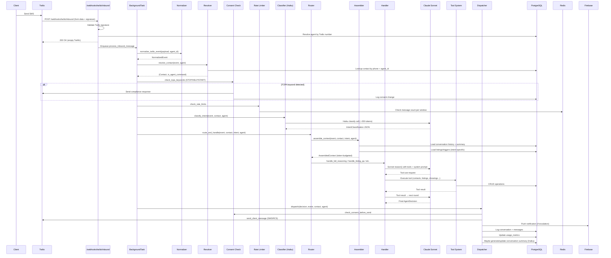
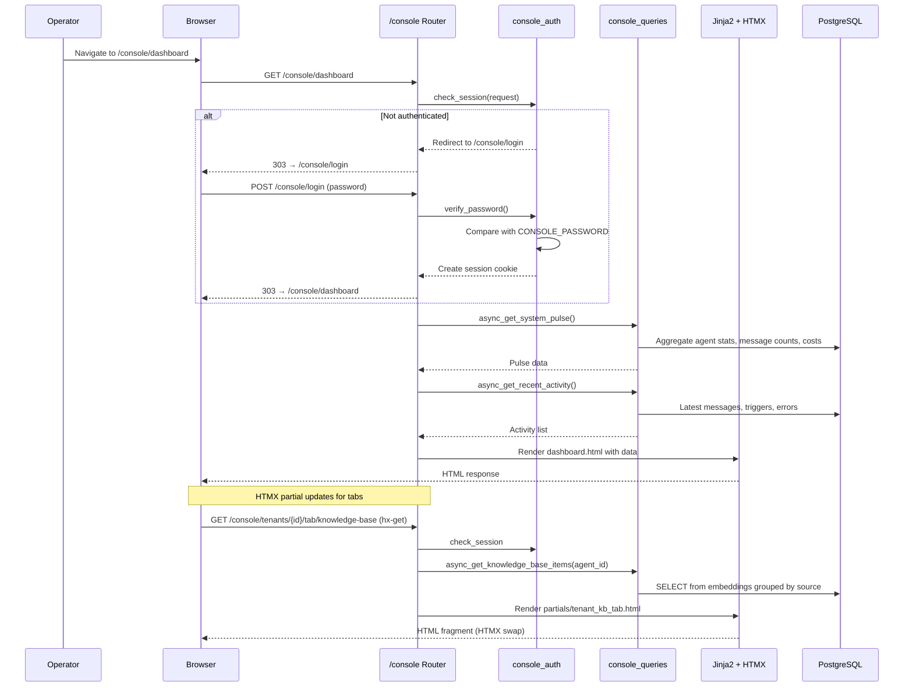
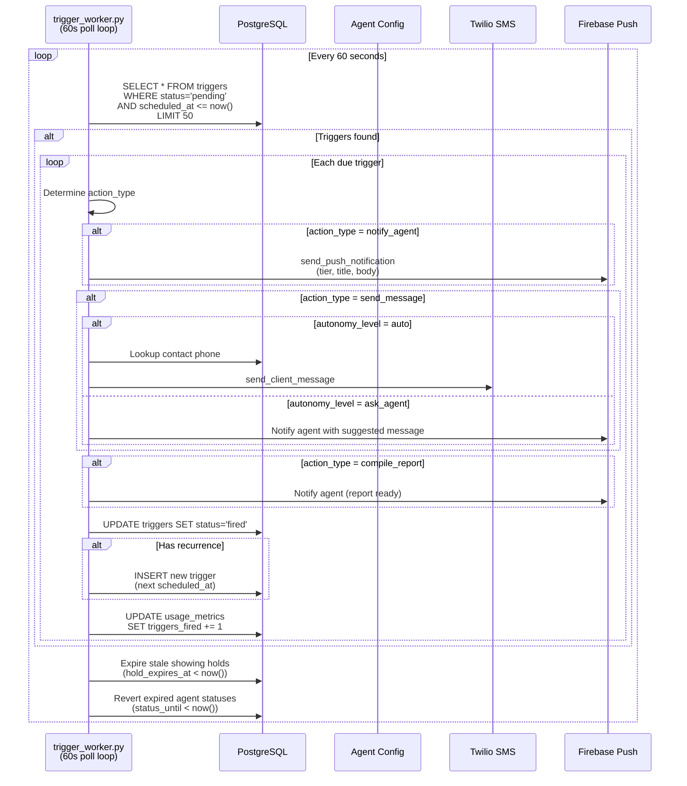
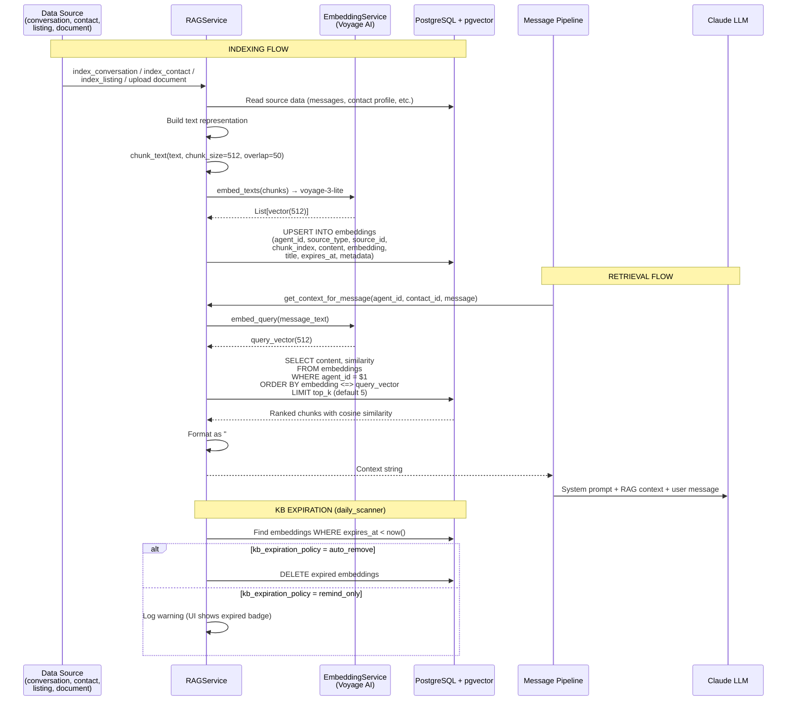
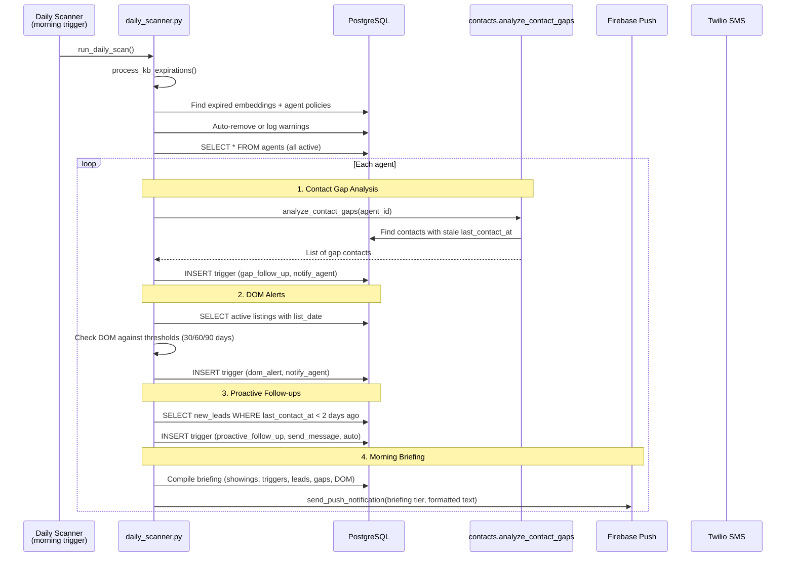
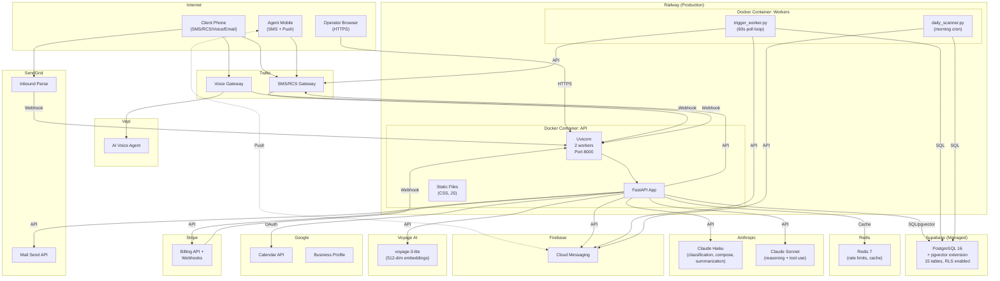
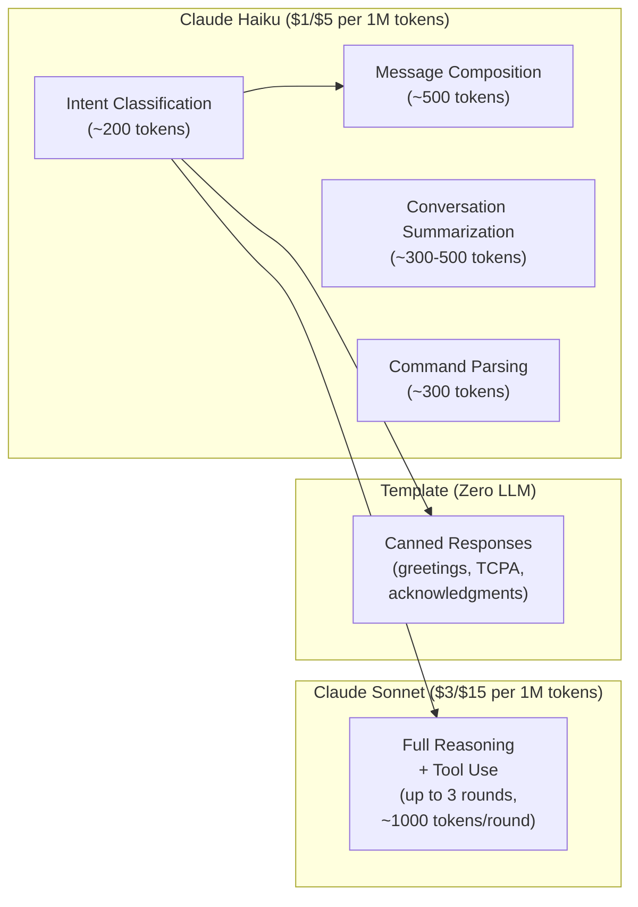

# Calloway Architecture Diagrams

Comprehensive architecture documentation for the Calloway AI Operational Assistant platform. All diagrams reflect the actual codebase as of March 2026.

---

## 1. System Context Diagram

Shows Calloway's external actors and the third-party services it integrates with.

```mermaid
graph TB
    subgraph Actors
        Agent["Real Estate Agent<br/>(SMS commands, mobile app)"]
        Client["Agent's Clients<br/>(SMS/RCS, Voice, Email)"]
        Operator["System Operator<br/>(Admin Console)"]
    end

    subgraph Calloway["Calloway Platform"]
        API["FastAPI Application<br/>(Uvicorn, 2 workers)"]
        Workers["Background Workers<br/>(trigger_worker, daily_scanner)"]
    end

    subgraph ExternalServices["External Services"]
        Twilio["Twilio<br/>(SMS/RCS/Voice)"]
        Vapi["Vapi<br/>(AI Voice Agent)"]
        Anthropic["Anthropic Claude<br/>(Haiku + Sonnet)"]
        VoyageAI["Voyage AI<br/>(voyage-3-lite embeddings)"]
        GoogleCal["Google Calendar<br/>(OAuth, scheduling)"]
        GoogleBiz["Google Business Profile<br/>(Reviews)"]
        Firebase["Firebase Cloud Messaging<br/>(Push notifications)"]
        SendGrid["SendGrid<br/>(Inbound/Outbound email)"]
        Stripe["Stripe<br/>(Billing, subscriptions)"]
        Supabase["Supabase<br/>(Hosted PostgreSQL 16 + pgvector)"]
        Redis["Redis 7<br/>(Cache, rate limiting)"]
    end

    Client -- "SMS/RCS" --> Twilio
    Client -- "Voice call" --> Twilio
    Client -- "Email" --> SendGrid
    Twilio -- "Webhook POST" --> API
    SendGrid -- "Inbound Parse webhook" --> API
    Vapi -- "Post-call webhook" --> API
    Stripe -- "Billing webhook" --> API

    API -- "Send SMS/RCS" --> Twilio
    API -- "Forward voice" --> Vapi
    API -- "LLM classify/reason/compose" --> Anthropic
    API -- "Embed text (512-dim)" --> VoyageAI
    API -- "Send email" --> SendGrid
    API -- "Push notifications" --> Firebase
    API -- "Calendar read/write" --> GoogleCal
    API -- "Review link" --> GoogleBiz
    API -- "Billing API" --> Stripe
    API -- "SQL + pgvector" --> Supabase
    API -- "Cache/Rate limit" --> Redis
    Workers -- "SQL queries" --> Supabase
    Workers -- "Push notifications" --> Firebase
    Workers -- "Send SMS" --> Twilio

    Agent -- "SMS commands" --> Twilio
    Agent -- "Push notifications" <-- Firebase
    Agent -- "Mobile portal" --> API
    Operator -- "HTTPS /console" --> API
```

---

## 2. Component Diagram

Internal component structure of the Calloway FastAPI application.

```mermaid
graph TB
    subgraph FastAPI["FastAPI Application (app/main.py)"]
        subgraph Middleware["Middleware"]
            CORS["CORS Middleware"]
            CorrID["Correlation ID Middleware"]
        end

        subgraph APIRouters["API Routers"]
            Webhooks["Webhooks Router<br/>/webhooks/*<br/>twilio/inbound, twilio/status,<br/>twilio/voice, vapi/post-call,<br/>email/inbound"]
            Console["Console Router<br/>/console/*<br/>Dashboard, Tenants, Conversations,<br/>Triggers, Costs, Errors, KB Mgmt"]
            Harness["Harness Router<br/>/harness/*<br/>Conversation simulator"]
            Health["Health Router<br/>/health"]
            Billing["Billing Router<br/>/billing/*<br/>Stripe webhooks, plans"]
            AgentPortal["Agent Portal Router<br/>/portal/*<br/>Agent-facing UI"]
            Onboarding["Onboarding Router<br/>/onboarding/*"]
            Conversations["Conversations Router<br/>/conversations/*"]
        end

        subgraph Pipeline["Message Pipeline (app/pipeline/)"]
            Normalizer["Normalizer<br/>normalize_twilio_event<br/>normalize_vapi_event<br/>normalize_email_event"]
            Resolver["Resolver<br/>resolve_contact"]
            Consent["Consent<br/>check_tcpa_keywords<br/>check_consent_before_send"]
            RateLimiter["Rate Limiter<br/>check_rate_limits"]
            Classifier["Classifier<br/>classify_intent"]
            PRouter["Router<br/>route_and_handle"]
            Assembler["Assembler<br/>assemble_context<br/>(token budget mgmt)"]
            Handlers["Handlers<br/>handle_agent_command<br/>handle_full_reasoning<br/>handle_listing_qa<br/>handle_escalation<br/>handle_template"]
            Dispatcher["Dispatcher<br/>dispatch<br/>(send response, log,<br/>metrics, summarize)"]
        end

        subgraph Commands["Command Handlers (app/pipeline/commands/)"]
            ListingCmd["listing_command"]
            BroadcastCmd["broadcast"]
            ClientInstr["client_instruction"]
            ContactQuery["contact_query"]
            NoteCmd["note_command"]
            ConnectCmd["connect_command"]
            StatusCmd["status_change"]
            HandoffCmd["handoff_return"]
            ScheduleQuery["schedule_query"]
            GapQuery["gap_query"]
            TriggerCmd["trigger_command"]
            CascadeCmd["cascade_command"]
            OfferCmd["offer_command"]
        end

        subgraph Tools["Tool System (app/tools/)"]
            ContactsTool["contacts<br/>lookup, create, update,<br/>analyze_contact_gaps"]
            ListingsTool["listings<br/>get, search, create, update"]
            ShowingsTool["showings<br/>create_hold, confirm,<br/>cancel, expire_stale_holds"]
            TriggersTool["triggers<br/>create_trigger"]
            CalendarTool["calendar_tools<br/>check_availability"]
            SellerTool["seller_tools<br/>seller reports"]
            TransactionsTool["transactions<br/>offer, contract tracking"]
            DripTool["drip_campaigns<br/>enrollment, progression"]
            LeadScoring["lead_scoring<br/>score leads"]
            MessagingTool["messaging<br/>send_client_message"]
            ActivityTool["activity<br/>activity logging"]
        end

        subgraph Services["Services Layer (app/services/)"]
            AnthropicSvc["anthropic_service<br/>classify (Haiku),<br/>reason (Sonnet + tools),<br/>compose (either model)"]
            RAGSvc["rag_service<br/>index, search,<br/>get_context_for_message"]
            EmbeddingSvc["embedding_service<br/>Voyage AI embeddings<br/>(512 dims)"]
            SummarizeSvc["summarization_service<br/>incremental conversation<br/>summarization (Haiku)"]
            TwilioSvc["twilio_service<br/>send_sms, send_client_message"]
            EmailSvc["email_service<br/>send/parse email (SendGrid)"]
            FirebaseSvc["firebase_service<br/>push notifications (FCM)"]
            GoogleSvc["google_service<br/>Calendar OAuth, availability"]
            VapiSvc["vapi_service<br/>voice agent integration"]
            AgentConfigSvc["agent_config<br/>get_agent_by_id,<br/>get_agent_by_twilio_number"]
            BillingSvc["billing_service<br/>Stripe integration"]
            TokenMonitor["token_monitor<br/>cost tracking per agent"]
            ConsoleSvc["console_queries<br/>dashboard data, KB mgmt"]
            RedisPool["redis_pool<br/>connection pooling"]
            RetrySvc["retry<br/>retry logic"]
        end

        Static["Static Files<br/>/static (CSS, JS)"]
        Templates["Jinja2 Templates<br/>/templates/console"]
    end

    Webhooks --> Normalizer
    Normalizer --> Resolver
    Resolver --> Consent
    Consent --> RateLimiter
    RateLimiter --> Classifier
    Classifier --> PRouter
    PRouter --> Assembler
    PRouter --> Handlers
    Assembler --> Handlers
    Handlers --> Commands
    Handlers --> Dispatcher
    Handlers --> AnthropicSvc
    Handlers --> Tools
    Dispatcher --> TwilioSvc
    Dispatcher --> EmailSvc
    Dispatcher --> FirebaseSvc
    Dispatcher --> SummarizeSvc
    RAGSvc --> EmbeddingSvc
    Console --> ConsoleSvc
    Console --> Templates
```



---

## 3. Data Flow Diagrams

### 3.1 Inbound SMS to Response (Full Pipeline)



### 3.2 Admin Console Request Flow



### 3.3 Background Trigger Execution



### 3.4 RAG Indexing and Retrieval



### 3.5 Daily Scanner Flow



---

## 4. Database Schema Diagram

All 15 tables with relationships and RLS policies.

```mermaid
erDiagram
    agents ||--o{ contacts : "has many"
    agents ||--o{ listings : "has many"
    agents ||--o{ conversations : "has many"
    agents ||--o{ messages : "has many"
    agents ||--o{ showings : "has many"
    agents ||--o{ triggers : "has many"
    agents ||--o{ transactions : "has many"
    agents ||--o{ drip_campaigns : "has many"
    agents ||--o{ drip_enrollments : "has many"
    agents ||--o{ emails : "has many"
    agents ||--o{ tool_executions : "has many"
    agents ||--o{ embeddings : "has many"
    agents ||--o{ usage_metrics : "has many"
    agents ||--o{ device_tokens : "has many"
    agents ||--o{ consent_log : "has many"
    agents ||--o{ conversation_summaries : "tenant_id"

    contacts ||--o| lead_preferences : "has one"
    contacts ||--o{ conversations : "has many"
    contacts ||--o{ showings : "has many"
    contacts ||--o{ transactions : "has many"
    contacts ||--o{ drip_enrollments : "has many"
    contacts ||--o{ consent_log : "has many"
    contacts ||--o{ conversation_summaries : "has many"

    listings ||--o{ showings : "has many"
    listings ||--o{ transactions : "may reference"

    conversations ||--o{ messages : "has many"
    conversations ||--o{ conversation_summaries : "has one"
    conversations ||--o{ tool_executions : "may reference"

    drip_campaigns ||--o{ drip_enrollments : "has many"

    messages ||--o| conversation_summaries : "last_message_id"

    agents {
        uuid id PK
        text name
        text email
        text phone
        text brokerage
        text market
        text timezone
        text twilio_number
        jsonb google_oauth
        text vapi_assistant
        jsonb scheduling_prefs
        jsonb style_profile
        jsonb autonomy_rules
        jsonb listing_rules
        text system_prompt
        text google_review_link
        time briefing_time
        text current_status
        timestamptz status_until
        int voice_daily_cap_minutes
        text kb_expiration_policy
        int kb_default_ttl_days
    }

    contacts {
        uuid id PK
        uuid agent_id FK
        text name
        text phone
        text email
        text role
        text lifecycle_stage
        uuid linked_listing_id
        jsonb preferences
        text notes
        timestamptz last_contact_at
        boolean silent_mode
        text consent_status
        text lead_source
        text language_detected
        int interaction_count
    }

    lead_preferences {
        uuid contact_id PK_FK
        text_arr areas
        text timeline
        boolean preapproved
        text property_type
        int bedrooms_min
        numeric bathrooms_min
        int price_min
        int price_max
    }

    listings {
        uuid id PK
        uuid agent_id FK
        text address
        int price
        int beds
        numeric baths
        int sqft
        int hoa
        jsonb features
        text showing_instructions
        text lockbox
        jsonb access_rules
        jsonb open_house_dates
        date list_date
        text status
    }

    conversations {
        uuid id PK
        uuid agent_id FK
        uuid contact_id FK
        text channel
        text stage
        text active_handler
        timestamptz last_message_at
    }

    messages {
        uuid id PK
        uuid agent_id FK
        uuid conversation_id FK
        text sender_type
        text body
        text intent
        boolean ai_generated
        text model_used
        int tokens_used
        text provider_message_id
        text delivery_status
        timestamptz delivered_at
        text failure_reason
        int feedback_score
    }

    showings {
        uuid id PK
        uuid agent_id FK
        uuid contact_id FK
        uuid listing_id FK
        timestamptz start_time
        timestamptz end_time
        text status
        timestamptz hold_expires_at
        text calendar_event_id
        uuid requesting_agent_id
        text feedback
    }

    triggers {
        uuid id PK
        uuid agent_id FK
        text entity_type
        uuid entity_id
        text trigger_type
        timestamptz scheduled_at
        text recurrence
        text action_type
        text message_template
        text autonomy_level
        text status
    }

    transactions {
        uuid id PK
        uuid agent_id FK
        uuid contact_id FK
        uuid listing_id FK
        text transaction_type
        text status
        int offer_price
        int final_price
        date closing_date
        numeric commission_pct
    }

    drip_campaigns {
        uuid id PK
        uuid agent_id FK
        text name
        text trigger_type
        jsonb steps
        boolean is_active
    }

    drip_enrollments {
        uuid id PK
        uuid agent_id FK
        uuid campaign_id FK
        uuid contact_id FK
        int current_step
        text status
    }

    emails {
        uuid id PK
        uuid agent_id FK
        text from_address
        text to_address
        text subject
        text body
        text classification
        uuid linked_contact_id FK
        uuid linked_listing_id FK
    }

    tool_executions {
        uuid id PK
        uuid agent_id FK
        uuid conversation_id FK
        text tool_name
        jsonb input_json
        jsonb output_json
        text status
        int latency_ms
    }

    embeddings {
        uuid id PK
        uuid agent_id FK
        text source_type
        uuid source_id
        int chunk_index
        text content
        vector_512 embedding
        text title
        timestamptz expires_at
        jsonb metadata
    }

    usage_metrics {
        uuid id PK
        uuid agent_id FK
        date date
        int messages_sent
        int messages_received
        int llm_calls
        int llm_tokens_used
        int llm_cost_cents
        decimal voice_minutes
        int sms_segments_sent
        int sms_cost_cents
        int voice_cost_cents
        int showings_booked
        int triggers_fired
    }

    device_tokens {
        uuid id PK
        uuid agent_id FK
        text fcm_token
        text device_name
        text platform
        boolean is_active
    }

    consent_log {
        uuid id PK
        uuid agent_id FK
        uuid contact_id FK
        text event_type
        text message_text
        text response_text
    }

    conversation_summaries {
        uuid id PK
        uuid tenant_id FK
        uuid contact_id FK
        uuid conversation_id FK
        text summary_text
        int messages_summarized_count
        uuid last_message_id FK
        int token_estimate
        int incremental_count
    }

    error_log {
        uuid id PK
        uuid agent_id FK
        text module
        text severity
        text message
        text stack_trace
        jsonb context_json
    }

    harness_traces {
        uuid id PK
        uuid agent_id FK
        jsonb trace_json
        text sender_phone
        text message_body
        text intent_detected
        text model_used
        int total_duration_ms
    }
```

**Row Level Security (RLS):** Every tenant-scoped table has `agent_isolation` RLS policies using `current_setting('app.current_agent_id')::uuid`, ensuring strict data isolation between agents.

---

## 5. Deployment Diagram



### Docker Configuration

- **API Container:** Python 3.12-slim, non-root user (`calloway`), 512MB memory limit, 1 CPU, health check against `/health`
- **Workers:** Same image, separate process for trigger polling and daily scanning
- **Local dev:** docker-compose with `pgvector/pgvector:pg16` and `redis:7-alpine`, hot-reload via volume mount

### Key Deployment Properties

| Property | Value |
|----------|-------|
| Runtime | Python 3.12, Uvicorn (2 workers) |
| Container | Docker multi-stage build (builder + runtime) |
| Database | Supabase-hosted PostgreSQL 16 + pgvector |
| Cache | Redis 7 |
| Hosting | Railway |
| Health Check | `/health` endpoint, 30s interval |
| Security | Non-root container user, RLS on all tables, CORS restricted, CSRF on console, Twilio signature validation |

---

## 6. Model Tiering Strategy



All token usage and costs are tracked per agent per day in the `usage_metrics` table, visible in the operator console.
